# 下载安装资源篇

## Q1：首页的 bandbbs 栏目为什么空的/显示“No BandBBS account”？

你没在设置里登录米坛账号

## Q2：Bandbbs 的资源点击下载后不会和官方源一样自动下载？

Bandbbs 的资源点击下载后需要选择下拉框里的文件再下载安装，请下载前自行确定资源适配的穿戴设备型号是否与你的设备型号一致。

## Q3：资源显示 404 或“resource not found”
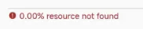

这个资源不存在，请联系资源作者解决

## Q4：出现“error sending request for url”怎么办

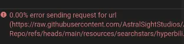

你可以尝试在设置中切换 CDN，并重启应用，如果都不可以请尝试魔法

## Q5：出现“No devices are connected”/“deadline has elapsed”怎么办

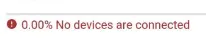

请确认手环是否已经连接，回到主页确定当前连接状态，建议多重启应用，重试几次。

## Q6：出现“channel closed”怎么办

可能是手环与ab的连接断开，此时可以尝试重新连接；

也可能是 Authkey 错误，这个是由于恢复出厂后/随机的某个时间 Authkey 会更换，重新连一下小米运动健康，然后会 AstroBox 登录小米账号同步最新的 Authkey 即可

## Q7：出现“Prepare not READY!”怎么办

请确保手环拥有充足的存储空间或电量，然后重启手环，如果还是不行请点击资源旁边的编辑按钮随便改一个 id。

对于 Redmi Watch 5 esim，请你降级版本，系统限制了应用安装。

## Q8：出现“Timeout waiting for protokey”怎么办

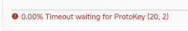

请重启 AstroBox 和手环并再次尝试

## Q9：出现“failed to open file”怎么办

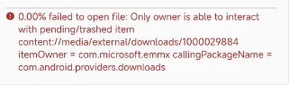

1. 请检查自己的文件是否下载完整

2. 检查是否授予 AstroBox 足够的文件读取权限

## Q10：出现“failed to get metadata of path”怎么办

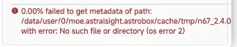

你可以检查一下手环是否安装上了这个应用，大概率是 AstroBox 本身的 bug

## Q11：出现“url is not a valid path”怎么办

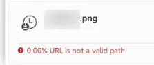

请检查你的文件格式是否正确，通常为 bin 或者是 rpk（快应用）

## 🌟 Q12：固件安装可以用吗？

:::danger

<mark>请最好别用安卓手机传输固件，容易丢包，建议用其他设备尝试。安卓的固件安装功能建议移步隔壁Notify For Xiaomi。固件安装过程中请不要对手机、手环做任何操作！不要安装非同一型号、非同一地区的固件到手环！固件安装是十分危险的行为，导致任何后果 AstroBox 团队概不负责！如果你要尝试固件安装，推荐将设置里的发包间隔改为 10。</mark>

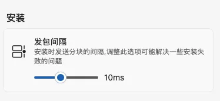

:::

## Q13：下载安装了两个或多个表盘，设备只显示其中一个，怎么办？

这种问题是资源开发者没有使用了同一个表盘ID导致的资源替换，请按照以下方法操作

1. 在设置中关闭自动安装功能

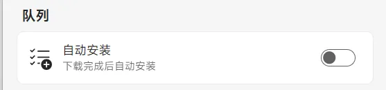

2. 下载/安装本地资源，在队列里点击下方红圈内的“画笔”图标

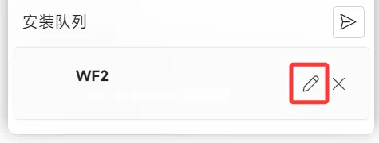

3. 在弹窗中随意输入9/12位数字，或点击红圈的“随机”图标，然后点击下方修改按钮

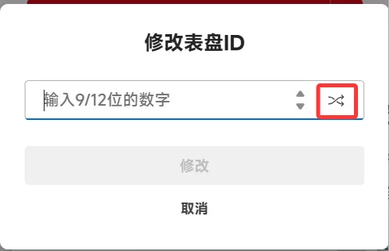

4. 点击红圈所示按钮发送表盘到设备即可

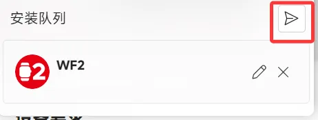

:::note

本教程由Yulimfish，川.，wuhaiqi等人编写，本人（lladlam）仅为第三方转载，著作权归Yulimfish，川.，wuhaiqi等人所有

:::
