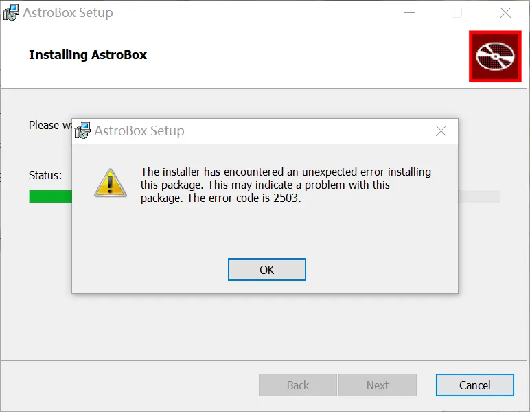
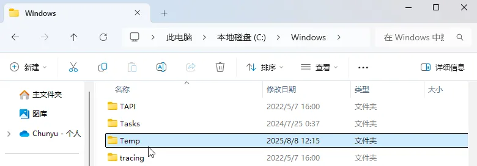
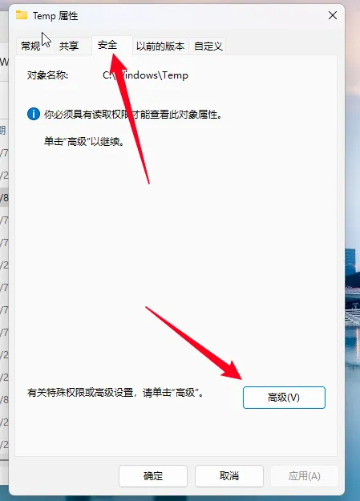
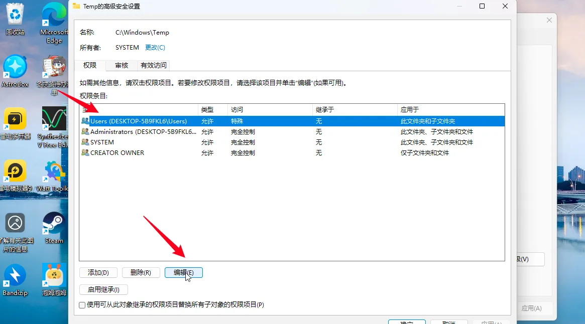
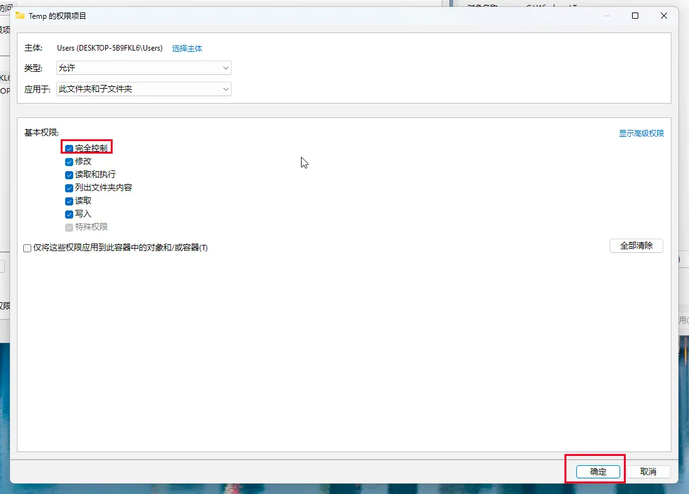
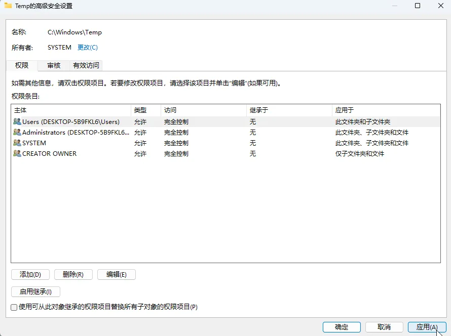

# 入门/安装篇

## 手机安装的时候显示“解析软件包出现问题”？

请检查你的安卓版本是否在<mark>**安卓 10 及以上**</mark>，13 以下版本稳定性差，<mark>**推荐使用 13 及以上安卓版本**</mark>。

## Q1：Mac 打开显示“‘AstroBox.app’已损坏，无法打开。你应该将它移到废纸篓。”？

在命令行执行以下指令并输入密码

```bash
sudo xattr -r -d com.apple.quarantine /Applications/AstroBox.app
```

## Q2：Windows 安装的时候显示报错码 2502/2503？



首先去官网重新下载安装包，看看安装包有没有在下载过程中损坏了。

如果不行，那就是 msi 的安装权限问题。<mark>首先先确认你是否将主程序解压后再开始运行，如没有请先解压后再试</mark>，如还不行就请你按照以下流程操作：


<details>
	<summary>点击此处展开/折叠内容</summary>
	
	1.右键此文件夹，点击属性
	
	
	
	2. 在安全选项卡下选择当前用户，点击编辑

	

	
	
	3.选择完全控制后点击确定
	
	
	
	4.回到原页面点击应用
	
	
	
	点击左侧箭头展开
	1. 右键此文件夹，点击属性
	
	2. 在安全选项卡下选择当前用户，点击编辑
	
	3. 选择完全控制后点击确定
	
	4. 回到原页面点击应用
	
	接下来可再次启动安装包尝试安装。
</details>

## Q3：首页加载速度慢/加载失败？

可以在设置中<mark>更换CDN</mark> 并重启，建议换成 ghp；如果你能接受一直开启代理使用，直接改成 raw 也可以

或者你也可以尝试一下在WiFi列表，打开右边设置，IP 设置，改为静态，把 DNS1 改 114.114.114.114 或者223.5.5.5（这个可以写到DNS2上面），DNS2 可改 8.8.8.8，然后返回会重新连接，再次刷新试试！

## 🌟 Q4：首页就像下面这样空白/设置页划不动？

此种空白的特征是：

1. banner 能够显示

2. 应用列表下只显示“已经被一查到底了”

3. 并且恰好你设置页也划不动

满足以上特征可以尝试此方法。

根据群友反馈，大概率此问题为系统 Webview 版本过低，请你将 Webview 更新到 115+

你可以尝试进入这个链接下载，优先选择共享库版本：https://www.123pan.cn/s/Zg85Vv-Fte8.html

如果安装失败可以检查安卓版本 或 在开发者选项关闭系统优化（比如 MIUI 优化）

如果是华为手机，安装后依旧无法使用，可以尝试在上面的链接里寻找华为版本的 Webview 安装，然后进入开发者选项-Webview 实现那边切换，两种都试试。

## Q5：动画卡顿/异常？

手机端出现这个问题是正常的，需要骁龙8G1以上芯片才能较好地展示动画。

## ~~Q6：Windows 11 设备更新到 1.5.0 主页白屏/什么都点不动~~

<mark>在 1.5.1 版本中已修复，请更新到最新版本</mark>

---
:::tip

不同系统有不同的版本号，注意区分

:::

---

## ~~Q7：鸿蒙用不了/装不了~~

<mark>在 1.2.0 版本中已可使用，只要你的安卓版本大等于 10</mark>

~~需要AOSP版本大于等于 13 的鸿蒙，如果是鸿蒙Next 可以直接使用卓易通尝试。目前已尝试的大部分华为机型都不可以使用，你可以试试，大概率也不行~~

## ~~Q8：协议页点不了同意？~~

<mark>此问题在 1.0.1 版本中已修复</mark>

~~首先请确定你是否把协议看完，<mark>划到底部了</mark>。若依旧无法点击，请<mark>挂小窗再点</mark>，后面会修复这个问题~~

:::note

本教程由Yulimfish，川.，wuhaiqi等人编写，lladlam转载时经过修改，著作权归Yulimfish，川.，wuhaiqi等人所有

:::
