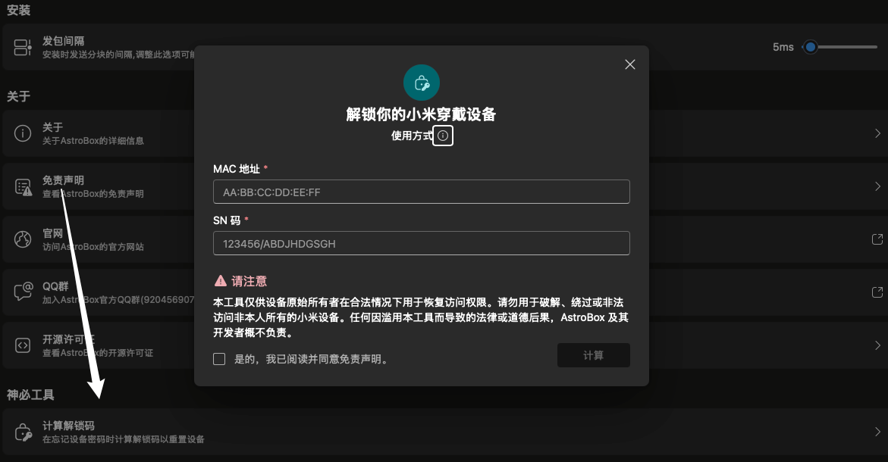

# 功能篇

# Q1：为什么插件市场空的用不了？

安卓版本在 1.0.1 以后已上线插件市场，如果依旧空白，请你检查网络。

## Q2：计算解锁码是什么功能？

这个功能用于你在忘记手环密码的时候使用，请不要随意尝试，获取并输入解锁码后会将手环恢复出厂设置

:::note

本教程由Yulimfish，川.，wuhaiqi等人编写，本人（lladlam）仅为第三方转载，著作权归Yulimfish，川.，wuhaiqi等人所有

:::
