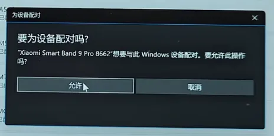
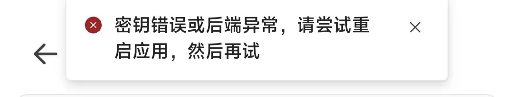
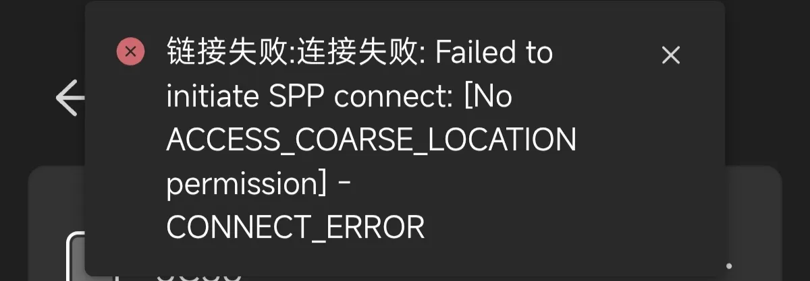

# 连接篇

::danger

特别注意：如果在设备页没有显示电量，就代表连接失败！请检查下方事项以解决此问题

:::

## Q1：目前什么手环可以使用？

| 型号 | 状态 | 备注 |
| :--- | :--- | :--- |
| **小米手环 10** | ✅ 完整支持 | |
| **小米手环 9 Pro** | ✅ 完整支持 | |
| **小米手环 9** | ✅ 完整支持 | |
| 小米手环 8 Pro | ❌ 不支持 | 过时设备 |
| 小米手环 8 | ❌ 不支持 | 无计划，系统情况无明确资料，协议版本不支持 |
| 小米手环 7 及更老机型 | ❌ 不支持 | 非 Xiaomi Vela 系统 |
| **小米 Watch S4 系列** | ✅ 完整支持 | |
| **小米 Watch S3 系列** | ✅ 完整支持 | |
| 小米 Watch S2 系列及更老机型 | ❌ 不支持 | 协议版本不支持 |
| 小米 Watch S1 Pro | ❌ 不支持 | 过时设备 |
| **红米 Watch 6** | ✅ 完整支持 | |
| **红米 Watch 5** | ✅ 完整支持 | |
| 红米 Watch 4 | ❌ 不支持 | 过时设备 |
| 红米手环系列 / 小米手环 Active 系列 | ❌ 不支持 | |

## 🌟 Q2：如何连接手环？

推荐步骤是：

1. 授予 AstroBox 蓝牙和位置权限

2. 登录小米账号 或 使用其他方式获得 Authkey

3. 在手机上退出小米运动健康并确保完全关闭（或切换至另一穿戴设备）

4. 在手环上进入<mark>**连接新设备模式**</mark>

5. 回到设备页面选择设备

6. Authkey 在登录小米账号的状态下会自动为你准备好，直接连接即可；未登录的话直接填入 Authkey 即可

7. Windows 需要在系统蓝牙设置中点击允许配对（可能会在<mark>**右下角弹出通知**</mark>，点击进去配对即可）

## Q3：手环链接后显示请在手机上点击确认，点击后没反应怎么办？

1. 检查是否授予 AstroBox 蓝牙和位置权限

2. 去蓝牙设置里忽略设备

3. 进小米运动健康重连设备

4. 深度关闭、停止小米运动健康

5. 手环进入连接新手机状态

6. 进 AstroBox 设置，重新通过小米账号同步 Authkey

7. 进入连接设备页重新连接

## Q4：如何获得 Authkey？
你可以直接在应用设置-同步设备 登录小米账号来一键获取，之后可以在连接设备页面里看到所有设备及其 Authkey，你也可以去小米运动健康里拿到 log 查到 Authkey。

## Q5：iOS 设备登录后，为什么连接设备页面没有自动显示账号里的设备？

因为 iOS 平台的特殊性，我们为 iOS 设备设计了新的连接步骤，请参考此文档。

## 🌟 Q6：为什么我连不上手环/几秒钟手环就断连了？

有任何链接问题请检查：

1. 小米运动健康是否<mark>**完全清除后台**</mark>（或“小米运动健康”的“附近的设备”权限是否处于关闭状态）

2. 表盘自定义工具、Notify For Xiaomi、GadgetBridge等<mark>**其它干扰项的权限均为关闭状态**</mark>，必要时可以直接卸载。（澎湃OS2用户可以尝试调整“互联互通服务”防止抢连接）

3. 手环是否进入<mark>**连接新设备模式**</mark>

4. 是否给 AstroBox<mark>**“附近的设备”、“蓝牙”、“位置获取”权限**</mark>

5. 电脑请检查是否有<mark>**蓝牙模块（4.0+）**</mark>，检查有没有在<mark>**设置点击确认，手环点击确认**</mark>

6. 请尝试在系统蓝牙设置中<mark>**“忽略”你的手环**</mark>，然后尝试重新连接<mark>**（iOS 用户尤其需要尝试此步）**</mark>。Windows由于系统特性可以重启电脑再试。

7. 如果<mark>**固件有更新版本**</mark>请在系统设置里<mark>**自行更新**</mark>

8. 安卓版本是否在<mark>**13 以上**</mark>

如果还是无法解决请多次重启手环、应用

## 🌟 Q7：显示“密钥错误或后端异常”怎么办

首先检查你的设备是否能在 AstroBox 中使用，详情点击[此处](#q1目前什么手环可以使用)

如果设备在支持列表中，请检查你的 Authkey 是否正确，有些设备会频繁更新 Authkey，需要你回到运动健康再次连接更新后，将手环进入连接新手机状态，再次进入 AstroBox 登录小米账号获取。

## Q8：显示“连接失败…SPP…LOCATION permission”

请你检查是否授予 AstroBox 蓝牙和位置权限

:::note

本教程由Yulimfish，川.，wuhaiqi等人编写，本人（lladlam）仅为第三方转载，著作权归Yulimfish，川.，wuhaiqi等人所有

:::
