# 快速了解表盘自定义工具使用

:::warning
再次提醒：  
当你下载并安装社区用户分享的资源时，请谨慎检查内容。
:::

## 下载
发布页链接直达：[https://www.bandbbs.cn/threads/9797/](https://www.bandbbs.cn/threads/9797/)

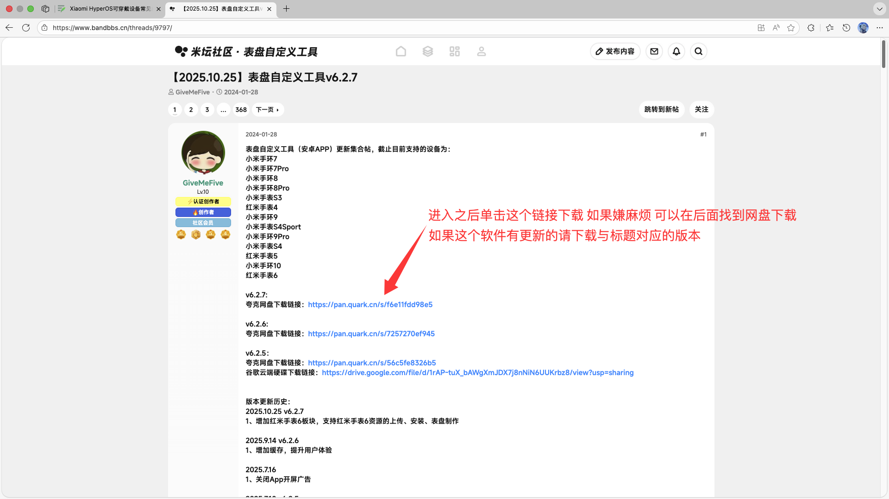

:::info
网盘链接内的文件为社区用户**聪明猫**提供，软件安全性请自行辨别。
:::
网盘链接：[表盘自定义工具.zip](https://www.123865.com/s/qfCejv-Fv2Nh)

## 使用

### 登录账号
进入后，首先你需要先切换设备。
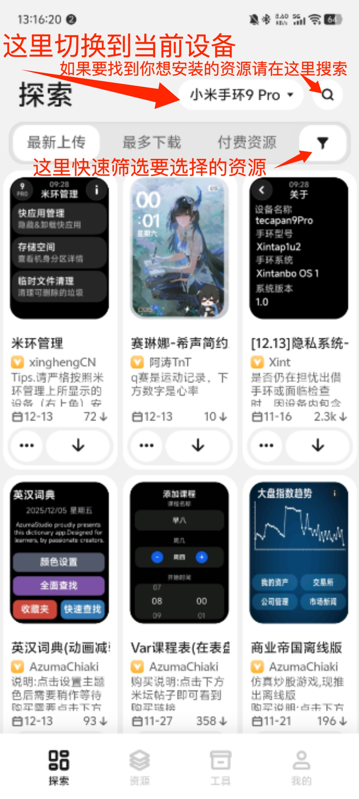

点击“我的”，上面有个登录，点击它。

你可以选择打开米坛社区网页进行登录，也可以选择米坛社区app登录，第一次建议使用米坛社区app登录。

### 成为捐赠者

::: tip
在捐赠开发者之前，请先试用。  
试用完成后觉得需要再去捐赠。不捐赠也可以正常使用蓝牙安装  
在捐赠后，你有48小时的时间可以申请退款，每个账号仅支持一次退款。
:::

在登录账号后，点击我的，在下面找到“捐赠开发者”选项

进去后，仔细阅读提示

确定完之后接下来记住下面的ID后面要用到

::: danger
请勿输入图片中的账号id，请输入你的账号id。
:::

接着打开微信 搜索框中输入“文件传输助手”不要直接在扫一扫进行选择图片！！！

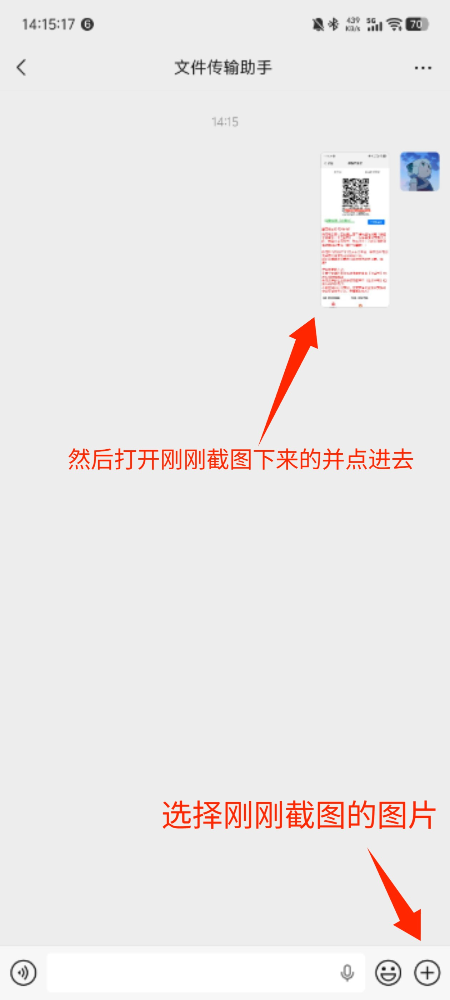
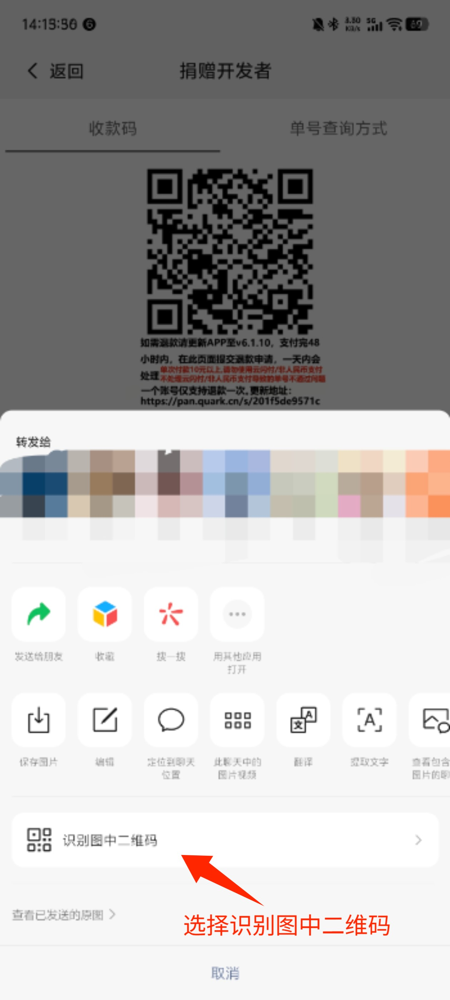

这里输入刚刚登录完表盘自定义或者捐赠二维码界面的id 然后付款
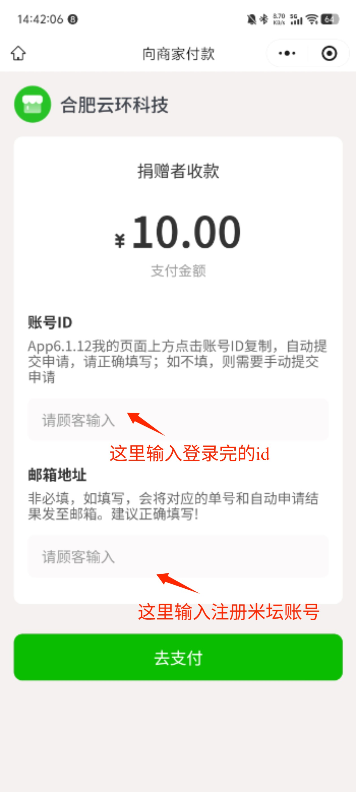

支付完成之后按照图文提示来

就像下面这样

支付完成在聊天界面选择“微信支付”

按照下面指的地方打开
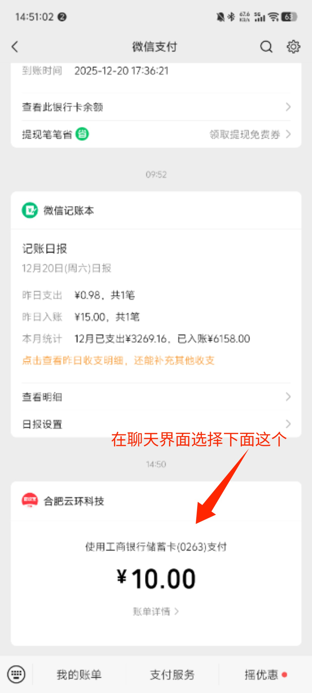

:::warning
请勿使用/租借他人账号 这样做你会面临封号风险
:::

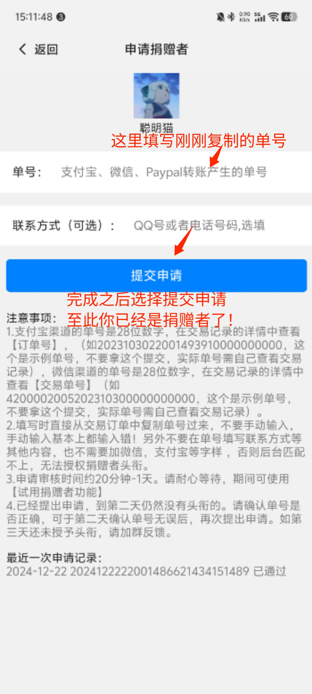

### 页面？

最新上传：

是开发者最新上传的快应用、游戏、表盘

如果你在之前下载过快应用、游戏、表盘发现在这里说明进行了更新 

切记！有更新一定要再安装一遍 否则你卸载重新装购买过的快应用、游戏、表盘需要重新购买！
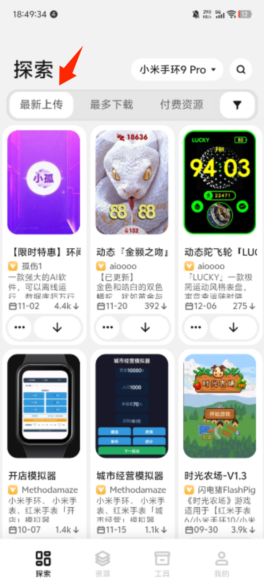

最多下载：

是根据下载数量进行排序 越多的人下载就是新设备到手推荐下载的

在这里大部分会在评论区教你怎么使用

切记！有更新一定要再安装一遍 否则你卸载重新装购买过的快应用、游戏、表盘需要重新购买！
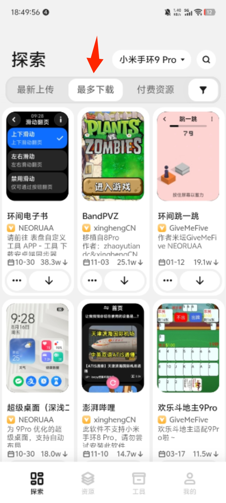

付费资源：

顾名思义 这里的东西都是付费的 即你需要通过米坛社区、爱发电等其他地方进行购买

切记！有更新一定要再安装一遍 否则你卸载重新装购买过的快应用、游戏、表盘需要重新购买！
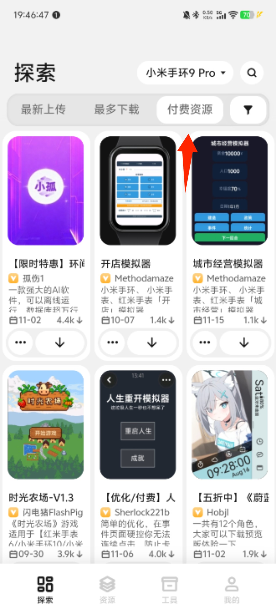

分类-游戏：

顾名思义 在这里下载到的都是游戏

但大部分都需要购买 会在下一个教程讲到

切记！有更新一定要再安装一遍 否则你卸载重新装购买过的快应用、游戏、表盘需要重新购买！
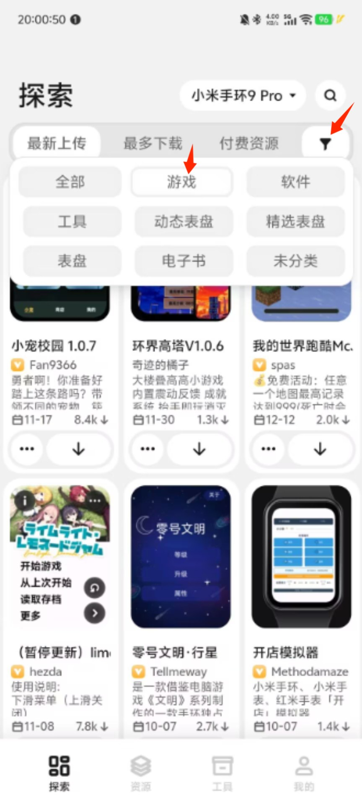

分类-软件：

顾名思义就是软件 在这里下载都是日常必备、工具、计算器之类的

部分软件会更新及时 所以请阅读下一句重点内容

切记！有更新一定要再安装一遍 否则你卸载重新装购买过的快应用、游戏、表盘需要重新购买！
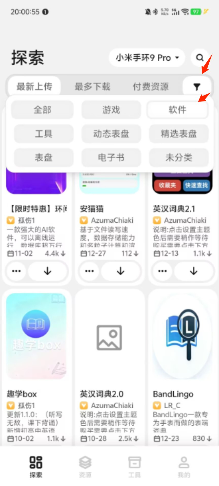

分类-工具：

这里的东西非常重要！！！各位上手一定要下载！！！

如果米环管理遇到更新先删除原来的再下载新的

切记！米环管理如果在使用过程中出现绿码不要使用米环管理！！！切换正常表盘即可！！！
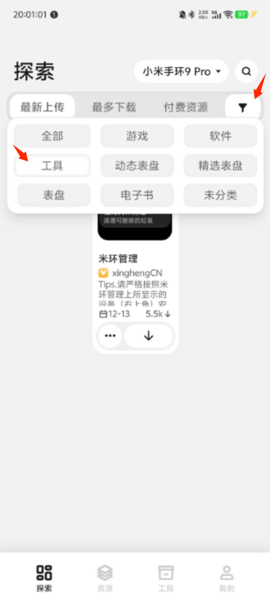

分类-动态表盘：

顾名思义就是动态表盘 这类比较使手环在游玩快应用、游戏这类会造成卡顿 特别是传电子书、安装资源这类 建议切换回没有动态的表盘 占资源较大 会导致显示预安装失败

建议安装一个即可
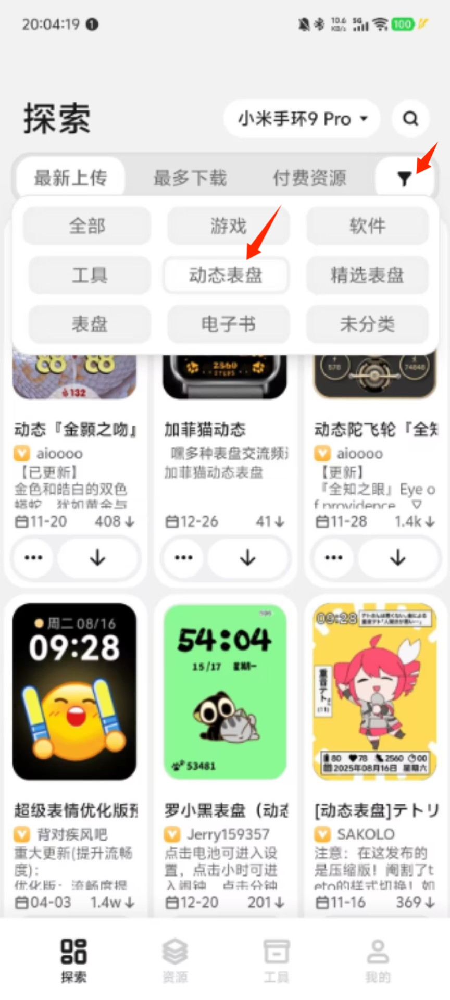

分类-精选表盘

顾名思义就是官方精心挑选的表盘 这类大部分是静态表盘 会比较省资源并且能快速的找到你心仪的表盘 适合小白使用

切记！有更新一定要再安装一遍 否则你卸载重新装购买过的快应用、游戏、表盘需要重新购买！
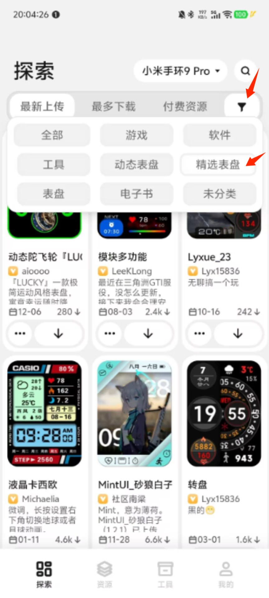

分类-表盘

顾名思义就是完完全全没有任何动态表盘是静态的它更加小 部分大的元素多的基本上都是好用的
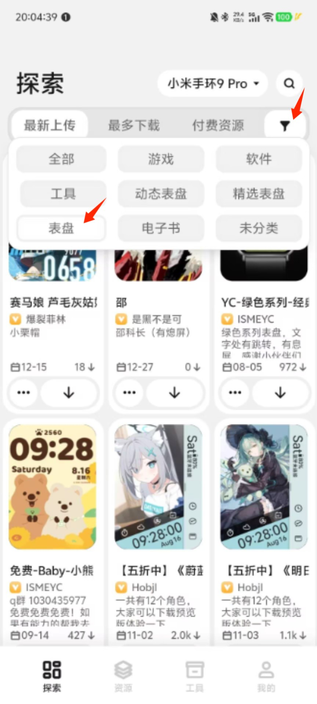

## Q&A
1.小米手环10没有环间电子书？

建议安装喵喵电子书或者弦电子书 手机端可在米坛搜索并下载 手环端直接在表盘自定义工具搜索就可以了

2.为什么安装资源会提示预安装失败？

出于系统原因，快应用数量最大可以到20个。如果你是`REDMI WATCH 5 eSIM`用户，请降级系统。

3.为什么安装时会提示安装失败？

1. 快应用/表盘安装`数量达到限制`
2. 没有正确连接到设备

4.我找不到要找的资源？

如果在自定义工具上搜索不到的话，可以尝试去米坛社区搜索。

5.为什么s3/s4sport没有表盘？

切换设备，选择`Watch S4`。

6.为什么会提示手环没有网络？

使用小米运动健康，正确连接后即可使用网络。

:::tip
手环系列目前只有`9Pro`支持，其余不支持
:::

7.为什么传完电子书手环不显示？

建议使用弦电子书

8.为什么使用AuthKey读取工具（新）读取不出来？

如果你使用的是小米运动健康，请你使用`AuthKey读取工具`，而不是使用`AuthKey读取工具（新）`。
